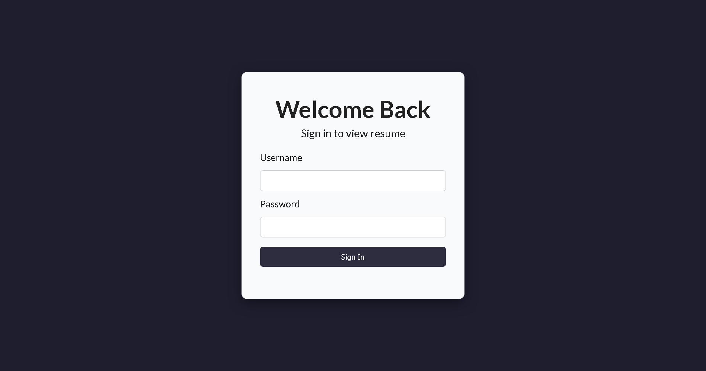
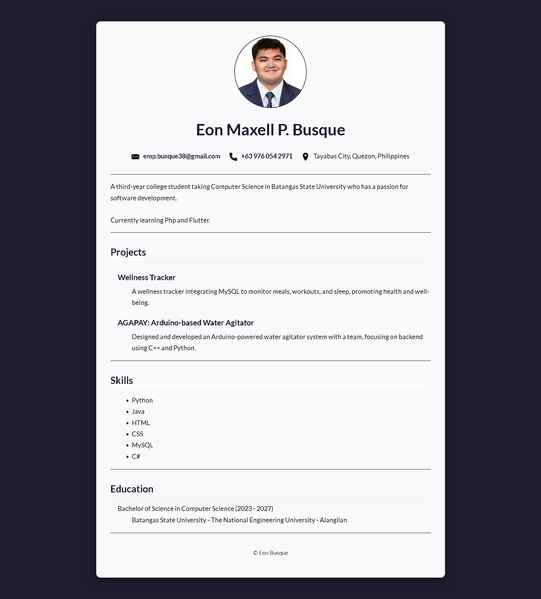

# Resume-Login

A resume page with login integration using **PHP**, **HTML**, **CSS**, and **PostgreSQL** (running under XAMPP).  

---

##  Features

- User authentication (login)  
- Access control: only logged-in users can view the resume  
- PHP backend + PostgreSQL database (connection only)  

---

## Project Structure

```bash
Resume-Login/
├── .vscode/
├── public/
│   ├── assets/
│   │   ├── css/
│   │   │   ├── loginStyles.css
│   │   │   └── resumeStyles.css
│   │   └── images/
│   │       ├── eon-profile-picture.png
│   │       ├── location.png
│   │       ├── mail.png
│   │       └── phone.png
│   ├── login.php
│   └── resume.php
└── screenshots/
    ├── Login_Page.png
    └── Resume_Page.png
```

---

## 🖼️ Screenshots

| Login Page | Resume Page |
|------------|-------------|
|  |  |

---
